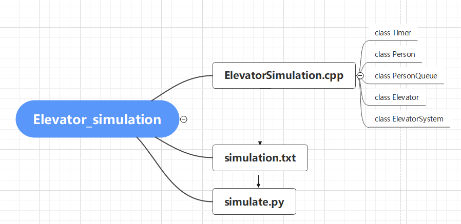
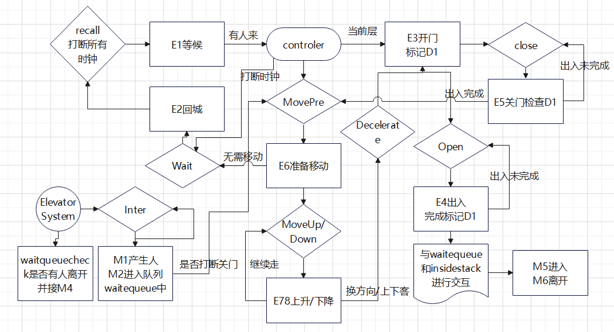
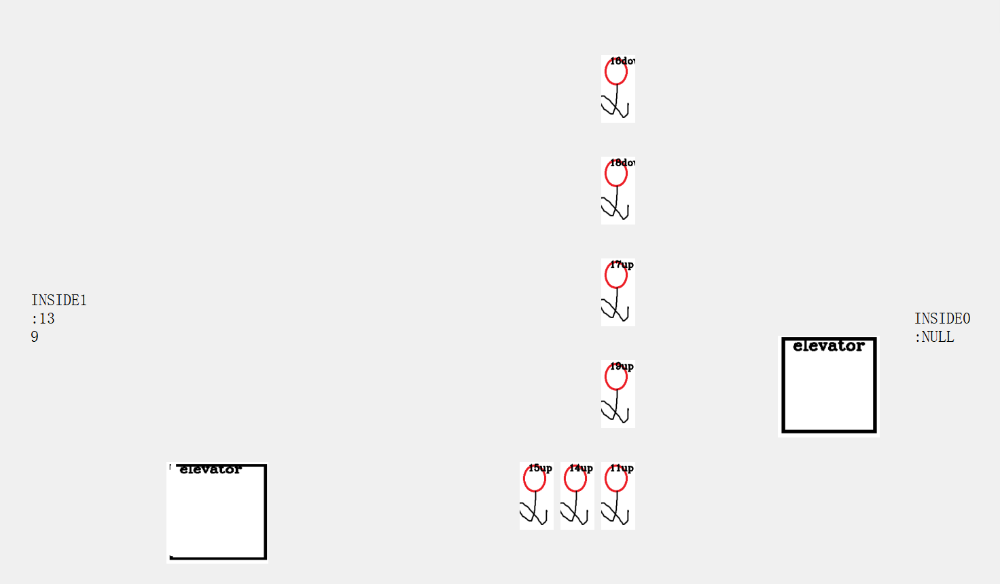

# Elevator_Simulation_System
hw for data structure, simulate an elevator system.With Gui.

## 代码框架

代码主要由ElevatorSimulation.cpp对电梯系统的各种行为进行模拟，并由此产生电梯的行为信息存放在simulation.txt中，在使用simulate.py制作GUI界面演示。

## 实验环境

windows10, C++标准库，python pyside2, 可由以下代码安装依赖

~~~ cmd
pip install pyside2
~~~

## 实现思路

### 主要的数据结构准备

#### class Timer时钟类

对于电梯系统中各种事件的发生，采用一个Timer时钟类对其进行模拟，采用Clock变量进行全局时钟模拟，Timer的成员函数及其功能如下：

~~~c++
#define ClockOff 0
#define ClockRun 1
#define ClockOver 2
class Timer {
    public:
    	Timer(){}//初始化函数，默认为ClockOff态
        void Start(int _WaitTime) {}//启动时钟
        int Check() {}//返回当前时钟状态，Clockoff/ClockRun/ClockOver,如果是ClockOver则重新回到ClockOff状态
        void Kill() {}//重置时钟至ClockOff态
};
~~~

可以采用以下方式实现一个时钟中断

~~~c++
Timer Clk;
Clk.Start(100)
for(int Clock = 0;Clock <= 100; ++Clock)
	if(Clk.Check() == ClockOver)
		...
~~~

#### class Person 成员类

成员类主要模拟了电梯系统中人的出现和离开以及和电梯的交互

一个成员的信息主要有其进入层InFloor，离开层OutFloor，以及放弃时间GiveUp时钟。状态InWait表示其是否在等待队列中，其类属性和方法如下

~~~c++
class Person {
    friend class ElevatorSystem;
    private :
        int InFloor, OutFloor;
        bool InWait;
        Timer GiveUp;
    public:
        int id; // 方便输出
        void M1(int _id) {} //随机化产生成员信息
        int M4() {}//判断成员是否放弃等待
        int M5(int Elevator_id) {}//进入某个电梯
        void M6(int Elevator_id) {} //离开某个电梯
};
~~~

#### class PersonQueue成员队列

其实成员队列由两个类PersonQueueLink和PersonQueue实现，主要维护了一个电梯系统中人在某层的等待队列，采用链表方式实现。类属性和方法如下

~~~c++
class PersonQueueLink {
    public:
        Person *Data; //成员信息
        PersonQueueLink *next; //链指针
        PersonQueueLink(Person *p = NULL) {} //初始化
};
class PersonQueue {
    friend class Elevator;
    friend class ElevatorSystem;
    private:
        PersonQueueLink Head, *Tail;//队头和队尾指针
    public:
        PersonQueue() {}//初始化队列
        void Push(Person *p) {}//队头入队列
        Person *Front() {}// 返回队头信息
        bool Empty() {}//是否空
        bool Pop() {}//队尾出队列，返回是否操作成功
        void Check() {}//检查当前队列中成员是否放弃等待，如果放弃，删除之
        void OutPut(bool updown, int Floor) {}//输出信息，用于debug
}
~~~

#### class 电梯类

主要实现了一个电梯的行为模拟。电梯状态由Idle，GoingUp，GoingDown三个部分组成。电梯的信息包括当前位置Floor，门状态D1，以及五个按钮CallCar(二进制压位)，电梯内部准备从各层离去的人的栈InsideStack[5]，和栈顶StackTop[5]，以及各种动作时钟。由一个Activate函数判断各种时钟中断，以此进行不同的电梯行为并连锁出发其他的时钟。

~~~c++
class Elevator {
    friend class ElevatorSystem;
    public:
        Elevator_State State; //电梯当前状态
        int Floor; //电梯当前位置
        int D1; //D1 0 除非有人进入和离开
        int CallCar; //5个目标层按钮, 使用状态压缩
        int Elevator_id;
        Person *InsideStack[5][1001];
        int StackTop[5]; //栈顶
        void OutPut() {}//输出信息
    private:
        Timer Wait, Open, Close, Move_Pre, MoveUp, MoveDown, Decelerate, ReCall;
        Elevator() {}
        void E1() {} //等候判断，如果等待状态下有人出现，调用Controller进行下一步行动
        void E2() {}//等待超时回到第一层
        void E3() {} //开门
        void E4() {} //出入
        void E5() {} //关门检查
        void E6() {} //准备移动 & 改变状态
        void E7() {}//上移
        void E8() {}//下移
        void Activate() {
            if(clk.Check()==ClockOver)
                Ex();
           	...
        }//处理各种时钟中断
        void Controler() {} //制动
};
~~~

### class ElevatorSystem电梯系统的实现

电梯系统主要由两个电梯，一个全局时钟Clock，一个等待队列waitqueue，一个成员内存池Pool组成，主要方法和属性如下

~~~c++
int Clock;
PersonQueue waitqueue[2][5];//0up1down
class ElevatorSystem {
    public :
        Elevator E1, E2;
        Person Pool[10001];
        Timer Inter;
        int PoolTop;
        void M2(Person &a) {} //人进入等待队列
        void Work() { //进行时序操作
            E1.Elevator_id = 0;
            E2.Elevator_id = 1;
            int SimulateTime;
            scanf("%d", &SimulateTime);
            Inter.Start(Rand(NEXTPERSONL, NEXTPERSONR));
            for(Clock = 0;Clock <= SimulateTime; ++Clock) {
                E1.Activate();
                E2.Activate();
                if(Inter.Check() == ClockOver)
                	M1(),M2(),Inter.Start();
                WaitQueue[i][j].Check();
            }
        }
        void Output() {}//输出相关信息
}A;
~~~

#### 电梯系统的控制逻辑

电梯系统的整体控制逻辑大致如下图所示，长方形中的是各种方法，而菱形中的则是在Activate函数里的各种时钟中断，以及对应中断触发的方法

## 运行及可视化GUI

### simulation.txt信息日志的输出

运行ElevatorSystem, 输入模拟时间（0.1s为单位）

在上述电梯模拟流程中对各类型的信息进行了输出，主要的输出模式如下

~~~c++
Clock opME opid info
~~~

比如进行了MoveUp的操作时，会在日志中写入如下信息

~~~c++
Clock 1 7 St Ed Time Elevator_id
~~~

表示电梯进行了E7上升操作，从St层到Ed层，耗费了Time时间，移动的电梯标号为Elevator_id

### GUI类的实现

采用pyside2，自主绘制的电梯图形和人类图形，在simulate.py中读取simulation.txt的电梯日志并进行图形化界面设计模拟。

运行simulate.py 即可得到界面

为方便检查模拟的时间加快了10倍。模拟的效果如下

中间为人的等待队列，标注了人的id和上下的方向，左右的INSIDE记录了电梯中人的编号。

### 可调式参数

电梯的可调式参数主要为人的放弃时间的上下限和不同人进入系统的间隔的上下限。

暂时不支持两个人同时进入电梯。

~~~c++
#define GIVEUPTIMEL 500
#define GIVEUPTIMER 1000
#define NEXTPERSONL 500
#define NEXTPERSONR 1000
~~~

GUI中的可调式参数主要为电梯的位置大小和模拟时长，以及人的位置

~~~python
Floor_Pos_x = [1200, 300]
Floor_Pos_y = [700, 550, 400, 250, 100]
Person_Pos_x = 1000
ELEVATOR_HEIGHT = 150
ELEVATOR_LENGTH = 150
PERSON_LENGTH = 50
PERSON_HEIGHT = 100
SIMULATETIME = 10000
~~~

**注意SIMULATETIME必须比simulation.txt的时间更长，否则会报错**

默认屏幕大小(2048, 960)，INSIDE字体的大小和位置在init_ui中也可以修改，这里不做详细介绍。